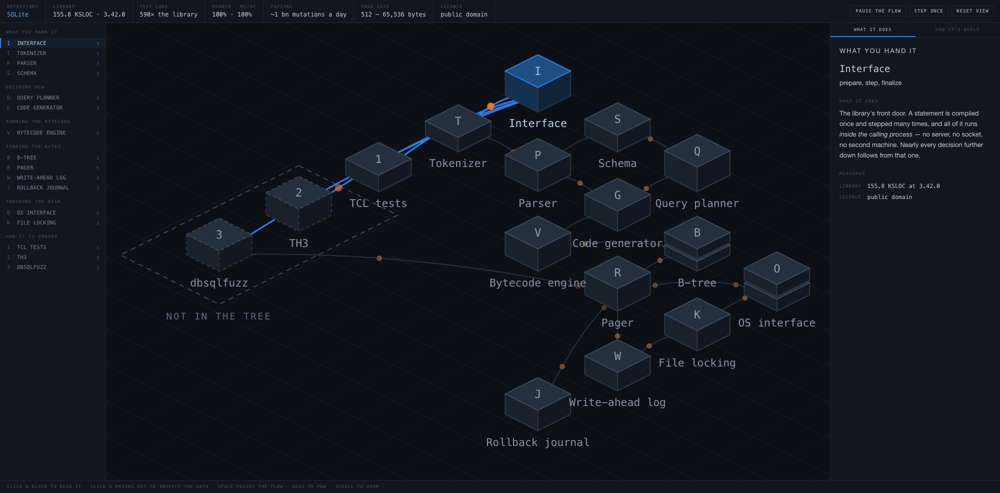

# codemap

A [Claude](https://claude.ai/code) skill that turns a codebase into an
explorable diagram: isometric blocks on a grid, an index of components, a
what-it-does / how-it's-built panel, and the system's own data moving along the
edges as dots you can stop and inspect.



Above is SQLite, traced from a statement handed to `sqlite3_prepare()` down to
the lock taken on the file. The blocks are its real components, the panel
carries its own documented constants — a write-ahead log that checkpoints at
1,000 pages and cannot cross a network filesystem, a query planner keeping 10
candidate join orders where its predecessor kept one, 590 times as much test
code as library code — and the orange dots carry values from its own
documentation, `2 OpenWrite 0 2 0 3` and page `type 0x0d`, rather than type
names. The dashed outline marks the two test harnesses that are **not** in the
public tree, which is where the 100% branch coverage figure actually comes
from.

That is the whole point. Every one of those facts took digging, and none of
them is visible in a file listing.

## What it is for

Diagrams of software are usually worthless because they are drawn from the
directory listing: boxes labelled *Service*, *Database*, *API*, arrows between
them, nothing a reader could not have guessed.

This skill spends its effort somewhere else. Most of the instruction is about
mining the repository for the things that are actually hard to find — measured
numbers, platform limits the code works around, comments explaining why a
constant is what it is — and putting those in the panel. The rendering is the
small part, and it is already written.

It ends with two tests worth applying to any architecture diagram:

- Pick any three nodes. What does a reader learn that the directory listing
  would not have told them?
- Could this diagram be relabelled for a different project without changing its
  structure?

## Install

**As a personal skill**, available in every project:

```bash
git clone https://github.com/beadnall/codemap.git ~/.claude/skills/codemap
```

**As a project skill**, so it travels with a repository and everyone on the
team gets it:

```bash
git clone https://github.com/beadnall/codemap.git <your-repo>/.claude/skills/codemap
```

**For Grok Build**, which scans its own skills directory and reads `SKILL.md`
the same way — so it needs no separate instructions file, only the right path:

```bash
git clone https://github.com/beadnall/codemap.git ~/.grok/skills/codemap
```

```bash
git clone https://github.com/beadnall/codemap.git <your-repo>/.grok/skills/codemap
```

Then ask for a diagram — "map this codebase", "show me how this fits together",
"diagram the architecture". The skill triggers on the intent, not on a
particular phrase.

There is also a `.skill` bundle on the
[releases page](https://github.com/beadnall/codemap/releases) for anyone whose
setup installs those directly.

## What's in it

```
codemap/
├── SKILL.md              the instructions — mostly about finding facts
├── assets/template.html  the working page; four data arrays to replace
└── scripts/
    ├── verify.py         fifteen static checks
    └── render.py         headless screenshot, so you can see it
        render.swift      macOS fallback needing no browser
```

`template.html` is complete and self-contained — isometric projection, panning,
zooming, the animation and the panel all work. Building a map means replacing
`STATS`, `NODES`, `EDGES` and `REGIONS`, plus the `<title>` and the
`<svg aria-label>`. `REGIONS` draws a dashed outline around the parts of the
system the repository does not own, and may be left empty.

## Platform support

|  | macOS | Linux | Windows |
|---|---|---|---|
| Building a map | yes | yes | yes |
| `verify.py` static checks | yes | yes | yes |
| `verify.py` syntax check | yes, built in | needs node, bun or deno | needs node, bun or deno |
| `render.py` | yes | yes | yes |

The syntax check tries `node`, then `bun`, then `deno`, then macOS's built-in
JavaScriptCore. With none of them present it **skips** that one check rather
than failing — the absence of a JavaScript runtime says nothing about your
page.

`render.py` drives Chrome, Chromium, Edge or Brave in headless mode, which
covers all three platforms with nothing to install if you have any of them. On
macOS with no such browser it falls back to `render.swift`, which uses the
system WebKit and needs only the Swift toolchain.

> Tested on macOS against JavaScriptCore and WebKit. The node, bun, deno and
> Chromium paths are written and unit-tested but have not been run on Linux or
> Windows hardware. Reports welcome.

## Why rendering is part of the workflow

Every fault that mattered while this was being built **passed static analysis
and was obvious the moment the page was rendered**:

- An empty right-hand panel, because the default selection named a node from a
  different project. `render()` threw on an undefined lookup before drawing
  anything. The page looked structurally perfect.
- Names clipped by neighbouring blocks, because labels were drawn inside each
  node's group and blocks paint back to front. It reads as a string being too
  long, which is the wrong diagnosis.
- Mojibake — em dashes as `a€` — because engines assume Latin-1 for a `file://`
  document with no charset.

`verify.py` learned the first two as checks. `render.py` fixes the third. Run
both.

## Other agents

Nothing in the method is Claude-specific — the template is plain HTML and
JavaScript, the scripts are Python, the instructions are markdown. Two things
do not carry across:

- **Discovery and triggering.** `~/.claude/skills/` and the `name` /
  `description` frontmatter are Anthropic's Agent Skills format. Most other
  tools will not scan that directory or use the description to decide when to
  fire, so you point them at the file yourself. Grok Build is the exception:
  it scans `~/.grok/skills/` (or `<repo>/.grok/skills/`) and picks up
  `SKILL.md` on its own, so installing it there is the whole setup.
- **Delivery.** The last step suggests an artifact or canvas where one exists,
  and writing the file to disk where one does not. The page is self-contained
  and opens in any browser with no server.

Entry points for the conventions each tool reads:

| Tool | File |
|---|---|
| Grok Build | none needed — install to `.grok/skills/` and it reads [SKILL.md](SKILL.md) |
| Codex, and others following the convention | [AGENTS.md](AGENTS.md) |
| Cursor | [.cursor/rules/codemap.mdc](.cursor/rules/codemap.mdc) |
| GitHub Copilot | [.github/copilot-instructions.md](.github/copilot-instructions.md) |

**These are repository-scoped, which matters.** A Claude skill installed in
`~/.claude/skills/` is available in every project you open. Cursor rules and
Copilot instructions are not — they apply to the repository that contains them.
So the copies here serve anyone working *in this* repository, and to use
codemap on your own project you copy the relevant file to that project's root:

```bash
cp .cursor/rules/codemap.mdc <your-project>/.cursor/rules/
cp .github/copilot-instructions.md <your-project>/.github/
```

Both point at `SKILL.md`, so keep codemap somewhere the agent can read it.

## Triggering

The skill fires on its own name — "create a codemap", "codemap this repo" — and
on the intent without it: "diagram this codebase", "show me the architecture",
"map how this works". It also handles a repository you have not cloned, reading
the tree and file contents through the GitHub API.

## Licence

MIT. See [LICENSE](LICENSE).
